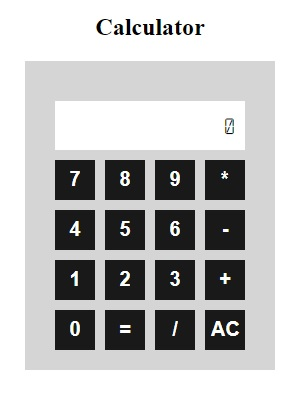

## Simple calculator with F#

This is a simple calculator web application built with F# and WebSharper, you can <a href="https://bhavik9085.github.io/calc_with_fsharp/" target="_blank" class="button">try out this app here.</a>

### Screenshot

### Getting Started

1. Clone the repository using git clone https://github.com/bhavik9085/calc_with_fsharp.git
2. Open the project in Visual Studio.
3. Run the project.

### How it works

The calculator uses F# for the backend logic and WebSharper for the frontend UI. The WebSharper library allows for creating a Single Page Application (SPA) with F#.

The application uses several functions to handle user interaction and perform calculations. Here's a brief description of some of the important functions:

* `formatNum`: This function formats a number to a scientific notation if the number exceeds a certain length.
* `eval`: This function takes a mathematical expression as a string and evaluates it using the MathJS library.
* `Click`: This function is an event handler that is triggered when a button is clicked. It performs different actions depending on the clicked button.
